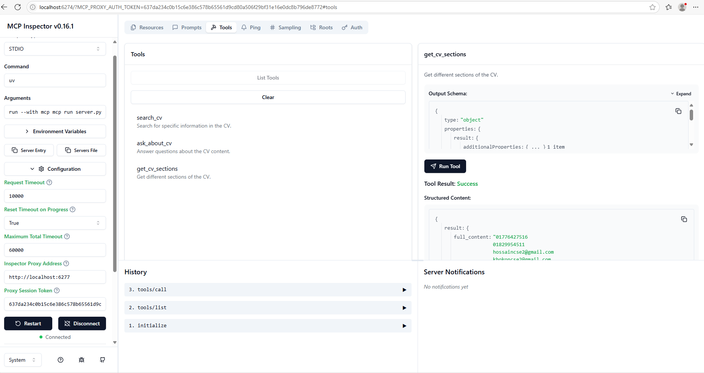
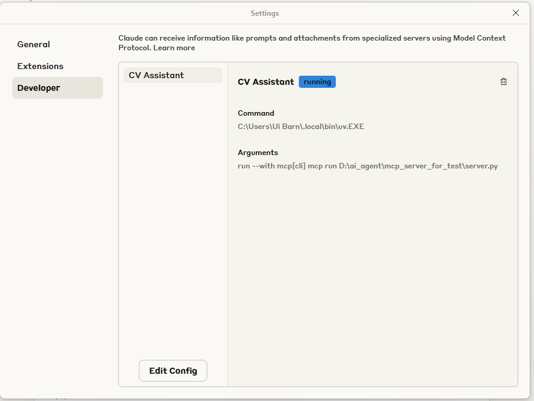
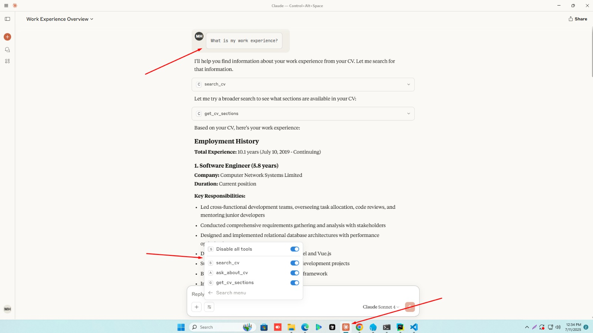

# MCP CV Assistant 📄

A powerful Model Context Protocol (MCP) server for CV/Resume analysis and processing. This tool allows you to upload, analyze, and extract information from CV documents seamlessly through Claude AI.





## 🚀 Features

- **PDF CV Upload**: Upload and process PDF CV/Resume files
- **Text Extraction**: Extract text content from uploaded documents
- **Section Analysis**: Break down CV into different sections (full content, length, preview)
- **MCP Integration**: Seamlessly integrates with Claude AI through Model Context Protocol
- **Development Mode**: Hot-reload development server for testing

## 🛠️ Installation

### Prerequisites

- Python 3.8 or higher
- `uv` package manager

### Step 1: Create Project Directory

```bash
# Create a new directory for our project
mkdir mcp_server_cv_assistant
cd mcp_server_cv_assistant
```

### Step 2: Initialize UV Project

```bash
# Initialize uv project
uv init
```

### Step 3: Create Virtual Environment

```bash
# Create virtual environment
uv venv
# Activate virtual environment (Windows)
.venv\Scripts\activate
# Activate virtual environment (Linux/Mac)
source .venv/bin/activate
```

### Step 4: Install Dependencies

```bash
# Install MCP and required packages
uv add mcp
uv add pypdf
uv add fastapi
uv add uvicorn
```

### Step 5: Create Server File

```bash
# Create the main server file
new-item server.py  # Windows
# OR
touch server.py     # Linux/Mac
```

## 🔧 Configuration

### Server Setup

Copy the server code into your `server.py` file. The server includes the following tools:

- `upload_cv`: Upload PDF CV files
- `get_cv_sections`: Extract and analyze CV sections
- `get_cv_text`: Get full text content from uploaded CV

### MCP Configuration

Add the following to your MCP configuration file:

```json
{
  "mcpServers": {
    "cv-assistant": {
      "command": "uv",
      "args": ["run", "server.py"],
      "cwd": "/path/to/your/mcp_server_cv_assistant"
    }
  }
}
```

## 🚀 Usage

### Development Mode

For development and testing:

```bash
# Run development server with hot-reload
mcp dev server.py
```

This command will:
- Start the MCP server in development mode
- Enable hot-reload for code changes
- Provide detailed logging and error information

### Production Mode

For production deployment:

```bash
# Install the server to make it available in Claude
mcp install server.py
```

After installation, the CV Assistant tools will be available in Claude AI interface.

### Claude Integration

Once the server is running, you can use the following commands in Claude:

1. **Upload CV**: Use the upload tool to process PDF CV files
2. **Analyze Sections**: Extract different sections of the CV
3. **Get Full Text**: Retrieve complete text content from the CV

## 🔨 Available Tools

### 1. `upload_cv`
- **Description**: Upload and process PDF CV files
- **Parameters**: `file_path` (string) - Path to the PDF file
- **Returns**: Status message and extracted text

### 2. `get_cv_sections`
- **Description**: Get different sections of the uploaded CV
- **Parameters**: None
- **Returns**: Dictionary with full content, length, and preview

### 3. `get_cv_text`
- **Description**: Retrieve the full text content from the CV
- **Parameters**: None
- **Returns**: Complete text content of the uploaded CV

## 📝 Example Usage

```python
# Example of using the CV Assistant tools
# 1. Upload a CV
upload_cv("path/to/your/cv.pdf")

# 2. Get CV sections
sections = get_cv_sections()
print(f"CV Length: {sections['length']} characters")
print(f"Preview: {sections['preview']}")

# 3. Get full text
full_text = get_cv_text()
print(full_text)
```

## 🔄 Development Workflow

1. **Start Development Server**:
   ```bash
   mcp dev server.py
   ```

2. **Make Changes**: Edit your server code

3. **Test Changes**: The server will automatically reload

4. **Deploy to Production**:
   ```bash
   mcp install server.py
   ```

## 📁 Project Structure

```
mcp_server_cv_assistant/
├── server.py              # Main MCP server file
├── pyproject.toml         # Project configuration
├── README.md              # This file
├── .venv/                 # Virtual environment
├── requirements.txt       # Python dependencies
└── examples/              # Example CV files (optional)
```

## 🐛 Troubleshooting

### Common Issues

1. **ModuleNotFoundError**: Make sure all dependencies are installed
   ```bash
   uv sync
   ```

2. **JSON Parse Error**: Check server output for syntax errors
   ```bash
   uv run server.py
   ```

3. **PDF Processing Error**: Ensure PDF file is valid and accessible

### Debug Mode

Enable debug logging by setting environment variable:

```bash
export MCP_DEBUG=true
mcp dev server.py
```

## 📋 Requirements

- Python 3.8+
- uv package manager
- MCP (Model Context Protocol)
- PyPDF for PDF processing

## 🤝 Contributing

1. Fork the repository
2. Create a feature branch
3. Make your changes
4. Test thoroughly
5. Submit a pull request

## 📄 License

This project is licensed under the MIT License - see the LICENSE file for details.

## 🆘 Support

If you encounter any issues or have questions:

1. Check the [Troubleshooting](#-troubleshooting) section
2. Review the MCP documentation
3. Create an issue in the repository

## 🔗 Links

- [MCP Documentation](https://docs.anthropic.com/mcp)
- [UV Package Manager](https://docs.astral.sh/uv/)
- [PyPDF Documentation](https://pypdf.readthedocs.io/)

---

**Made with ❤️ for CV Analysis and MCP Integration**